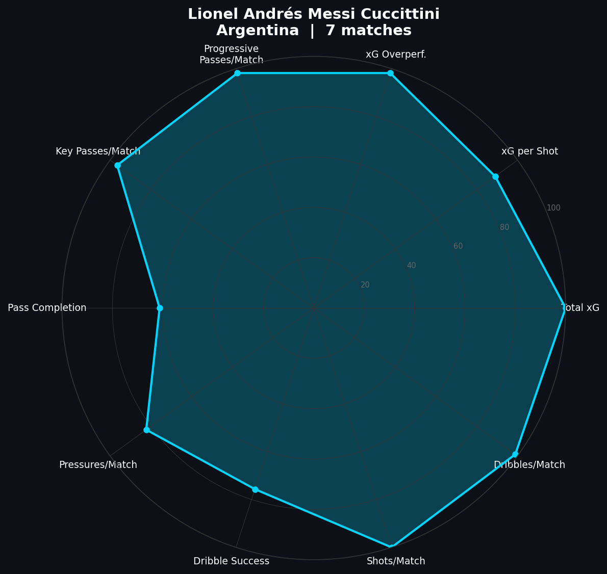

# Player Scout Engine — StatsBomb World Cup 2022

A player profiling and similarity engine built on StatsBomb open event data from the 2022 FIFA World Cup. Input any player name and get a full scouting report: percentile radar chart across 10 performance dimensions and a ranked list of the 5 most similar players in the tournament.

## What It Does

- Extracts and engineers player-level metrics from all 64 WC 2022 matches
- Computes percentile rankings vs every outfield player in the tournament
- Generates radar chart profiles on 10 performance dimensions
- Returns top 5 most similar players using cosine similarity
- Produces full scouting reports combining stats, percentiles, radar, and comparables

## Features Engineered

| Category | Metrics |
|---|---|
| Shooting | Total xG, xG per shot, xG overperformance |
| Passing | Progressive passes/match, key passes/match, pass completion % |
| Pressing | Pressures applied/match |
| Carrying | Dribbles attempted/match, dribble success rate |
| Volume | Shots/match |

All metrics normalized per match to make players across different tournament runs comparable.

## Models & Methods

- **Percentile ranking** — each player ranked against all WC 2022 players (min. 2 matches) across all 10 metrics
- **Cosine similarity** — StandardScaler normalization + pairwise cosine similarity matrix across the full feature set
- **KNN-style lookup** — top N most similar players returned for any input

## Example Output

**Lionel Andrés Messi Cuccittini — Argentina | 7 matches**

Most similar players:
1. Kylian Mbappé Lottin (France) — 0.854
2. Salem Mohammed Al Dawsari (Saudi Arabia) — 0.817
3. Robert Lewandowski (Poland) — 0.809
4. Olivier Giroud (France) — 0.793
5. Enner Remberto Valencia Lastra (Ecuador) — 0.786

## Data

Uses [StatsBomb open data](https://github.com/statsbomb/open-data) — no API key required. Covers all 64 matches from the 2022 FIFA World Cup.

## Stack

Python · scikit-learn · pandas · matplotlib · statsbombpy
